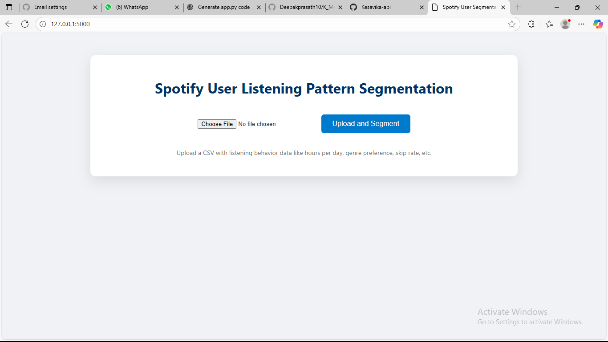

# Spotify User Listening Pattern Segmentation using K-Means Clustering

This project is a Flask-based web application that segments Spotify users based on their listening behavior using the K-Means clustering algorithm. It includes an interactive interface to upload CSV datasets, visualize optimal clusters using the Elbow Method, and export the segmented data.

## Use Case

**Objective**: Identify distinct listening behavior segments to enable personalized recommendations or marketing strategies.

**Example Features Used**:
- Hours listened per day
- Genre preference (numerically encoded)
- Skip rate
- Number of liked songs
- Artist diversity index

## Features

- Upload your own CSV file of user data
- Automatically preprocesses and standardizes data
- Elbow method to determine optimal number of clusters (k)
- Visual clustering plot based on key behavioral features
- Export segmented results to CSV
- Clean and responsive interface using HTML/CSS

spotify-user-segmentation/
├── static/                    # CSS styling
│   └── style.css
├── templates/                 # HTML templates
│   ├── index.html             # Upload form page
│   └── result.html            # Result page (table + visualizations)
├── uploads/                   # Uploaded and output CSV files
│   └── synthetic_spotify_user_data.csv   # Example dataset
├── app.py                     # Flask application
├── requirements.txt           # Required dependencies
└── README.md                  # Project documentation

## 1. Clone the Repository

git clone https://github.com/your-username/spotify-user-segmentation.git
cd spotify-user-segmentation

## 2. Install Dependencies
Ensure you're using Python 3.8 or above.
pip install -r requirements.txt

## 3. Run the Application

python app.py

Then visit:
http://127.0.0.1:5000/

## How to Use
Open the app in your browser.

Upload a CSV file with Spotify user listening data.

Click “Cluster Users” to segment the data using K-Means.

View the clustered data and download the output.

##Sample Input Format

User_ID	Hours_Listened	Genre_Preference	Skip_Rate	Liked_Songs	Artist_Diversity
U001	4.5	Pop	0.25	120	0.65

## Technologies Used

Python 3.8+

Flask

Pandas, NumPy, scikit-learn

HTML/CSS

## Screenshots

